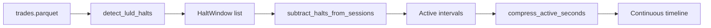

---
tags:
  - type/implementation
  - domain/data
  - domain/microstructure
  - project/src-core
  - status/complete
created: 2026-04-04
---

# LULD Halt Detection

> **File:** `src/data/luld_halt_detection.py` · **Lines:** 290

## Purpose

LULD (Limit Up-Limit Down) halt detection and active timeline construction. Uses 30s VWAP bands + 5-minute gap detection. Subtracts halt windows from trading sessions to produce compressed active-seconds timelines.

## Pipeline

## Classes

### `HaltWindow` (dataclass)
- `start`, `end`, `reason`
- `duration_seconds()` → float

## Key Functions

| Function | Purpose |
|----------|---------|
| `detect_luld_halts(trades, ...)` | 30s VWAP band breach + gap detection |
| `subtract_halts_from_sessions(sessions, halts)` | Remove halt windows |
| `compress_active_seconds(index, intervals)` | Continuous timeline |
| `prepare_active_trades(trades, ...)` | Master pipeline |

## Constants
- `BAND_BY_TIER = {"tier1": 0.05, "tier2": 0.10}`

## Dependencies
- **Internal:** None
- **External:** `pandas`, `numpy`, `pandas_market_calendars` (optional)

## Consumers
- [[Polars Loader]], [[Pandas Loader]], [[Regime Hawkes Correlation]]

---
*Back to [[Data Index]] · [[00-Index]]*
